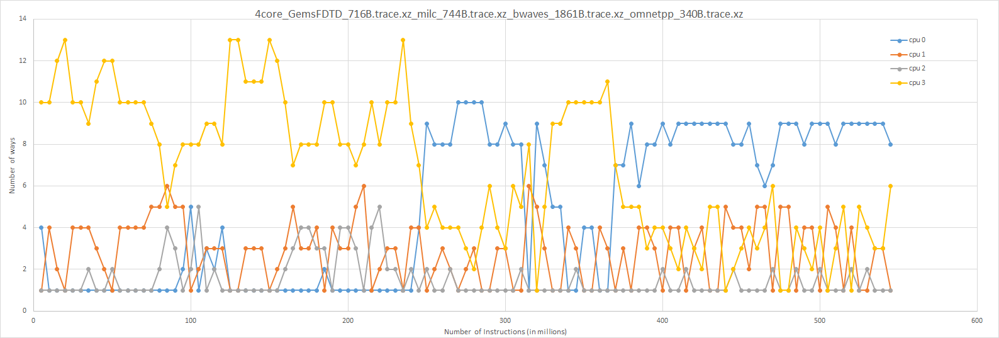
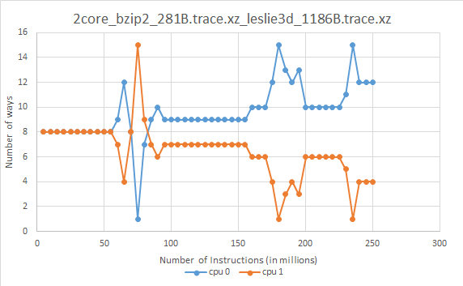

# Utility-Based Cache Partitioning in ChampSim Simulator

Implement [Utility-Based Cache Partitioning](https://ieeexplore.ieee.org/stamp/stamp.jsp?tp%3D%26arnumber%3D4041865) in ChampSim(trace-based simulator). It uses [The Lookahead Algorithm](https://ieeexplore.ieee.org/stamp/stamp.jsp?tp%3D%26arnumber%3D4041865) to find the right partition for each core for L3 cache and uses LRU without partition for L1 cache and L2 cache.

## How to run 

Run the following command to build the binaries
```
./build_champsim.sh bimodal no no no no <REP_POLICY> <NUM_CORE> 
```


Then run 
```
./run_2core.sh bimodal-no-no-no-no-<REP_POLICY>-<NUM_CORE>core <NUM_WARM> <NUM_INS> 0 <TRACE1> <TRACE2> ... <TRACE<NUM_CORE>>

```
to run the simulation

-  `REP_POLICY` is the replacement policy i.e. `lru` (without any partitioning) or `ucp` (with UCP as partitiong technique) 
- `NUM_CORE` is number of cores on which the code is to be run 
- `NUM_WARM` is number of warmup instructions 
- `NUM_INS` is number of instructions  
- `TRACEi` is name of the trace given'

> Give traces equal to value of `NUM_CORE`
## Brief Implementation Details

1. [Cache.h](inc/cache.h)
    - Defined all the functions used in [ucp.llc_repl](replacement/ucp.llc_repl)
2. [Cache.cc](src/cache.cc)
    - Modified the _check hit_ function to check the hit only for the ways it has access
3. [UCP.llc_repl](replacement/ucp.llc_repl)
    - **UMON_update**: This function takes the _cpu_, _set\_index_ and _way_ and updates the lru value of the whole set for the ATD.
    - **UMON_find_victim**: This takes _cpu_ and _set\_index_ and finds the way which is _lru_ for that _cpu_
    - **get_utility**: It returns the change in misses that occurs when the number of ways assigned to a _cpu_ increases by one
    - **UMON**: If the set is one of the sampled sets it checks the hits in that set. If not then calls the _UMON\_find\_victim_ and _UMON\_update_.
    - **make_partition**: It uses the number of hits in ATD and uses the [The Lookahead Algorithm](https://ieeexplore.ieee.org/stamp/stamp.jsp?tp%3D%26arnumber%3D4041865) to find the number of sets to be assigned to each core. It is called after every 5M cycles
    - **llc_initialize_replacement**: It runs at the starting of the simualtion. It finds the sample sets randomly and sets the intial LRU value of _L3 cache_ and _ATD_.

    - **llc_find_victim**: Editied this function to find the victim by taking in consideration the partitioning for each core. It also assigns the way to the corresponding core when the partitioning changes.
    - **ucp_update**: This function takes the _cpu_, _set\_index_ and _way_ and updates the lru value of the for L3 cache.
    - **llc_update_replacemetn_state**: Modified this function to call _make\_partition_ every 5M cycles and calls _ucp_update_

## Results
- The following graph shows the ways allocated to each core after every 5 million cycles, when the simulation ran for 4 core  

<center>

</center>
<br/>
<br/>

- The following graph shows the ways allocated to each core after every 5 million cycles, when the simulation ran for 2 core  
<center>

</center>